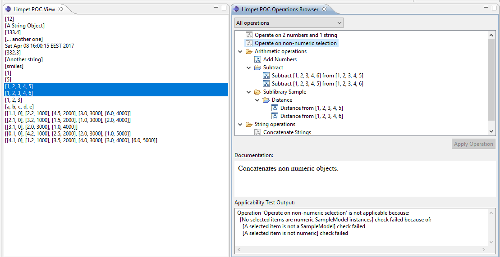

# limpet_ops
Temporary repo, to support development of Limpet operations library

# Requirements overview
The main requirements are listed [here](https://github.com/debrief/limpet/issues/65). In general we'd like to have an Eclipse RCP based framework to allow declaration of operations on an abstract model. Custom operations are contributed via extensions in plugins and the framework maintains a library of operations applicable in certain context.

Looking at [issues](https://github.com/debrief/limpet_ops/issues), including closed ones, would provide more details on the requirements.

# Plugins overview
* [sampleModel](#sampleModel) - contains metamodel classes, an abstraction of operations and extension point for other plugins to define operations.
* sampleOperation1 - defines operations via the extension point.
* sampleOperation2 - defines operations via the extension point.
* sampleTest - JUnit test plugin 
* [sampleView](#sampleView) - Contains UI (view) for displaying the library of operations and another view to provide objects and selection context.


# Plugin details
## sampleModel <a name="sampleModel"></a> 
Contains a model class - [SampleModel](sampleModel/src/samplemodel/SampleModel.java), it holds data - either Numeric or String and can have a timestamp. The model plugin also defines an interface for an [operation](sampleModel/src/samplemodel/SampleModelOperation.java). An extension point is defined with corresponding schema to allow plugins to contribute model operations. Note that the schema includes the core expression language exsd. Contributed operations need to define a property named "applicable" using the core expressions framework. 
## sampleView <a name="sampleView"></a>
The [SampleView](sampleView/src/sampleview/views/SampleView.java) is a JFace tree viewer with various objects as content, some numeric model, some string model, some not model at all (date). Upon right click, when the context menu is constructed, the ext. point registry is queried for operations and those applicable are contributed to the context menu. Note that at this point the operation plugins are not loaded. That only happens when you click the operation from the menu.

The [OperationsBrowserView](sampleView/src/sampleview/views/opsbrowser/OperationsBrowserView.java) is a more complex view. It's vertically split in three parts. The top part is a JFace tree viewer showing the list of registered operations in the library. Depending on the selection some operations would be unavailable (showed in gray). When such operation is selected, the "Apply Operation" button would be disabled and the bottom part - the "Applicability Test Output" shall display a meaningful message as to why the operation is not applicable to the current selection. The middle part contains documentation for the currently selected operation. A drop-down on top allows switching between the whole library of operations and those only applicable to the current selection (consider using checkbox instead).

The following screenshot shows the sample view (Limpet POC View) shown next to the Operations browser.

Clicking the "Apply Operation" button should actually load the plugin and the operation code, execute it and show the result in a popup.

# Target platform
Eclipse 3.8

# Known issues
## Errors reported in sampleModel.operation.exsd
The extension point schema imports the Eclipse Core expression language:
```xml
<include schemaLocation="schema://org.eclipse.core.expressions/schema/expressionLanguage.exsd"/>
```
For some reason Eclipse reports errors (in the problems view) for the referenced elements. Safe to ignore. 

# Misc closed issues
* [Include documentation for operation](https://github.com/debrief/limpet_ops/issues/1)
* [Document test failure reasons](https://github.com/debrief/limpet_ops/issues/3)
* [Commands & Operations](https://github.com/debrief/limpet_ops/issues/3) - describes the support for non-commutative operations.
